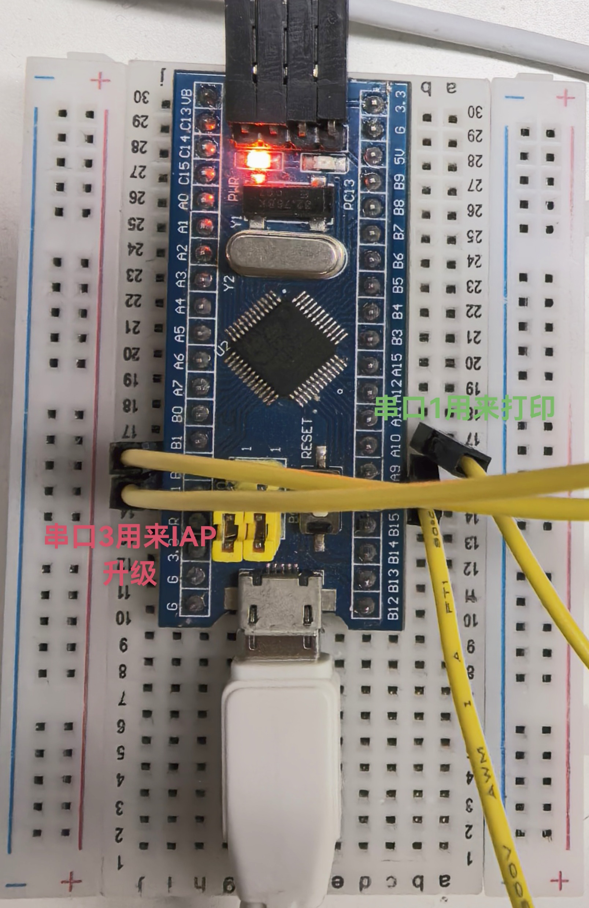

# STM32F103 Bootloader 和 IAP 源码 (ymodem 协议)

## 简介

本仓库提供了一套完整的 STM32 IAP（In-Application Programming）功能代码，包含 bootloader 和 IAP 两个工程代码。该代码已经在 STM32F103C8T6 开发板上调试通过，使用 Keil5 进行编译。通过上位机（如超级终端或 SecureCRT）发送二进制代码文件，并使用 ymodem 协议进行传输，可以实现 STM32 的在线代码升级功能。

## 使用说明

1. **环境准备**：
   - 开发环境：Keil5
   - 开发板：STM32F103C8T6
   - 上位机软件：超级终端或 SecureCRT
   - 串口1接打印，串口3接iap升级接口（注意这里使用串口3来升级）

        

2. **编译与下载**：
   - 使用 Keil5 打开 `Bootloader` 工程，编译并下载到开发板。
   - 使用 Keil5 打开 `IAP` 工程，编译并生成二进制文件（.bin）。

3. **在线升级**：
   - 打开超级终端或 SecureCRT，连接到开发板的串口3。
   
   - 使用 ymodem 协议发送 `IAP` 工程生成的二进制文件到开发板。
   
   - Bootloader 会接收并写入新的固件代码，完成后自动跳转到新固件运行。
 
## 启动运行流程

1. 初始状态：Flash中有 Bootloader + demo_iap (分区A)
2. 触发升级：demo_iap 通过UART+Ymodem接收新固件，写入到 分区B (备份分区)
3. 设置标志：demo_iap 设置升级标志，然后复位
4. Bootloader启动：检测到升级标志
5. 固件搬运：将分区B的内容拷贝到分区A (覆盖原demo_iap并检查)
6. 启动新程序：跳转到分区A运行新的demo_iap 

## 问题检查

- 确保上位机与开发板的串口通信正常，波特率设置正确。
- 在发送二进制文件时，确保文件路径和文件名正确无误。
- 如果遇到问题，请检查串口通信是否正常，或者参考代码中的调试信息进行排查。

## 注意

- 1、通过ymodem协议接收并写入新的固件代码（另外slip协议常用于升级，也会简单些，感兴趣自行了解porting）
- 2、只是简单将编译好的二进制bin文件烧写到flash，并没有制作各类头信息（一般需要制作各种头信息解析来决定后续bootloader的功能）
- 3、bootloader和IAP分开了，正常应该统一为`带IAP功能的bootloader`，这里只是为了方便测试做了一个demo，porting到自己的项目时，可以做简单参考，但是遇到任何问题，自行解决，不做支持
- 4、更细节的使用参考源码

## 许可证

本项目采用 MIT 许可证，详情请参阅 [LICENSE](LICENSE) 文件。