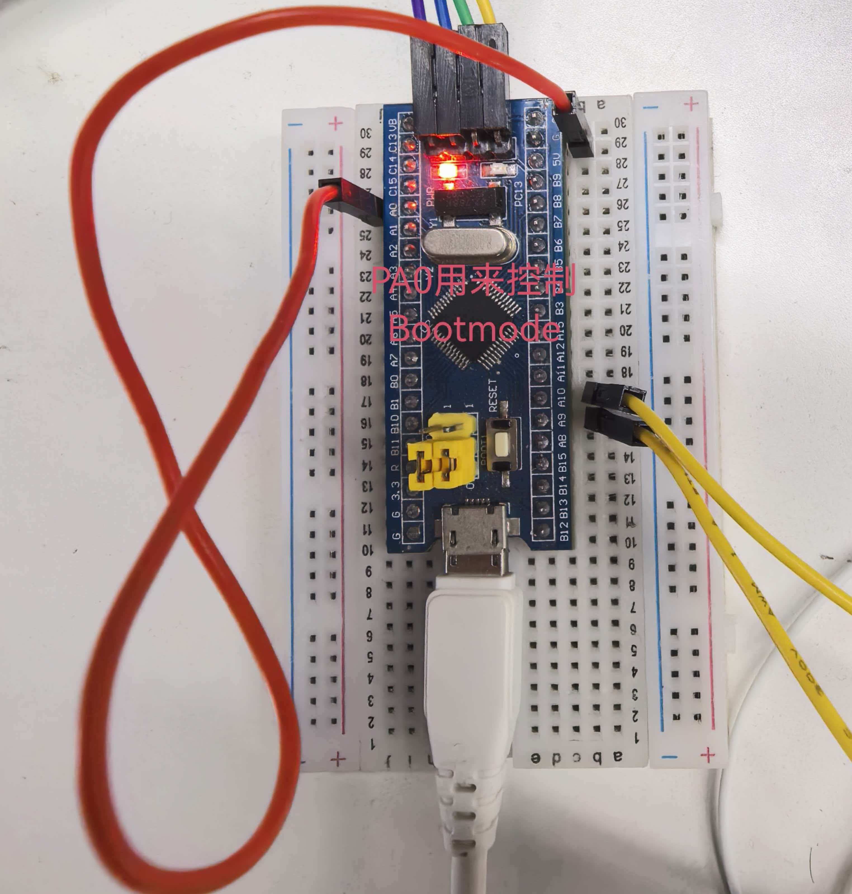
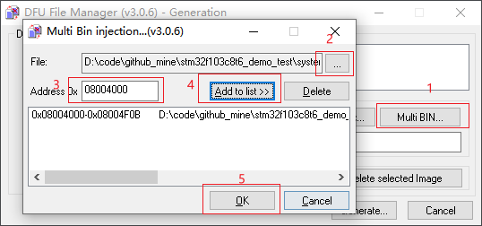
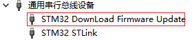
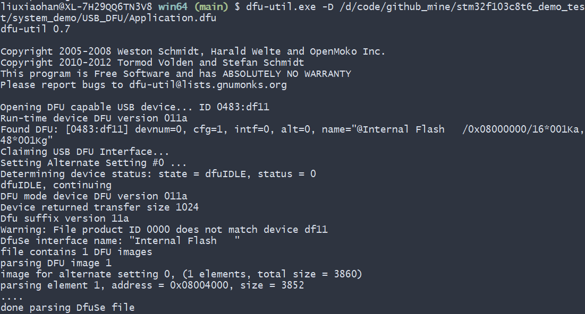

# STM32F103C8T6 DFU升级方案

## 实现机制

- 接线图



由于我们无法修改stm32自带的uart_isp(存放在rom里)，但是可以借助其原理：通过boot mode选择进入isp升级；我们来实现以下二级bootloader

1. 使用PA0来判断是否进入dfu模式，还是正常启动
PA0接GND，正常启动，判断后跳入app地址；PA0接VSS，表示进入DFU模式

2. 地址划分

这里将flash划分为两部分：
| Address                   | Function                  |
| -----                     | -----                     |
| 0x00000000 - 0x08003fff   | DFU Bootloader            |
| 0x08004000 - 0x08010000   | User Application          |

## 使用说明

1. keil打开DFU_Bootloader工程编译、烧写
2. keil打开Application工程编译
3. dfu文件生成
   - 需要用到DFU file manager软件
   - 选择Application工程生成的bin文件，按照下图所示，生成dfu文件
   
4. DFU模式启动、文件烧写
   - 将PA0接GND，重启开发板（有些开发板需要重新插拔usb口）进入DFU模式
   - 正常情况下PC会识别到该驱动（我用的win10是ok的，如果不行，需要装下驱动）
   
   - 按照下图将dfu文件烧写到对应位置
   
5. APP模式启动
   - 将PA0接到3.3，重启开发板将直接跳转到0x0800_4000处执行

## log

- dfu模式下烧写app到0x08004000
- app模式下启动bootloader直接跳转到app执行

```bash
-----------------bootloader----------------------------
-----------------dfu mode----------------------------
------1.used dfu-util to download app into 0x08004000
------2.PA0 connect to GND and then reset -----------
-----------------------------------------------------
-----------------bootloader----------------------------
----------------- normal bring up -------------------
----------------- jump to 0x08004000 ----------------
-----------------app------------------
```